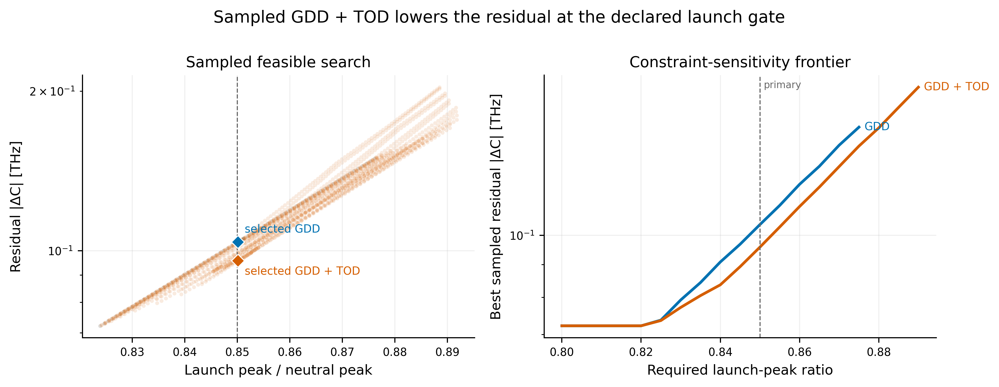
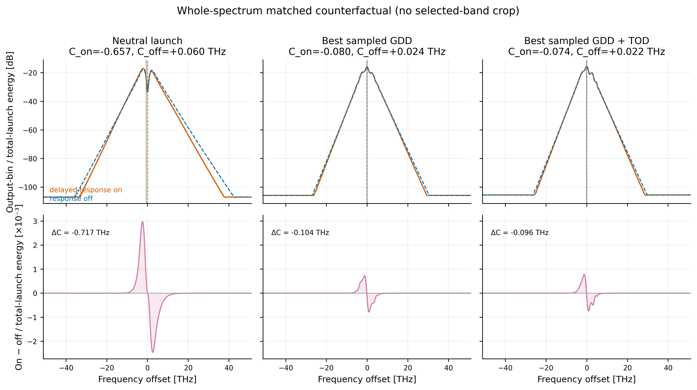
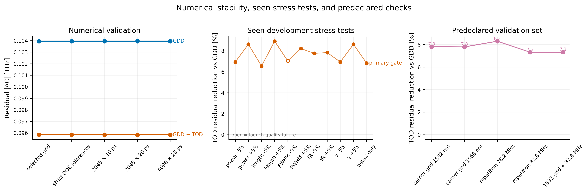

# Counterfactual Raman benchmark

## Result in one sentence

At the declared launch gates and over the sampled domains, the best feasible
quadratic+cubic input spectral phase had a `7.80%` smaller residual
whole-spectrum counterfactual centroid shift than the best feasible
quadratic-only phase in one scalar SMF28 model.

This is a reproducible computational result and a testable hypothesis. It is
not an experimental Raman decomposition, a fixed-GDD ablation, or evidence of
universal fiber behavior.



## Question and endpoint

The benchmark compares two otherwise matched propagations:

- delayed response on: `fR = 0.18`;
- delayed response off: `fR = 0`.

Its primary endpoint is

```text
ΔC = C_on - C_off,
C = Σ f |u(f)|² / Σ |u(f)|².
```

Here `f` is the FFT frequency offset from the optical carrier, not the absolute
optical frequency.

A smaller `|ΔC|` means a smaller delayed-response contribution to this model's
output spectral centroid. It does not by itself establish reduced Raman energy
transfer, improved output-pulse utility, or hardware performance.

The matched-problem contract verifies identical launch, grid, dispersion,
nonlinearity, length, solver tolerances, and Raman response shape. Only the
declared delayed-response fraction changes.

## Model and search

| Quantity | Value |
|---|---:|
| Fiber model | scalar `SMF28`, `0.5 m` |
| Average power | `0.1 W` |
| Pulse | `185 fs` sech², `80.5 MHz`, `1550 nm` |
| Grid | `1024` samples, `10 ps` |
| Nonlinearity | `γ = 1.1×10⁻³ W⁻¹m⁻¹` |
| Dispersion | `β₂ = −2.17×10⁻²⁶ s²/m`, `β₃ = 1.2×10⁻⁴⁰ s³/m` |
| Delayed response | single oscillator, `fR = 0.18`, `τ₁ = 12.2 fs`, `τ₂ = 32 fs` |

The input shaper applies

```text
φ(Ω) = φ₂ Ω² / 2 + φ₃ Ω³ / 6
```

about the carrier, with `Ω` in rad/fs. `φ₂` and `φ₃` are input spectral-phase
coefficients, not the fiber propagation coefficients `β₂` and `β₃`.

The sampled domains were `−6900 ≤ φ₂ ≤ −5200 fs²` and
`−600000 ≤ φ₃ ≤ 600000 fs³`. The coarse steps were `25 fs²` and `50000 fs³`;
the local refinement steps were `5 fs²` and `25000 fs³`. The quadratic-only
family was searched separately with `φ₃ = 0`.

Selected launches had to preserve phase-only input energy and satisfy:

- RMS-duration ratio `≤ 1.10`;
- peak-power ratio `≥ 0.85`;
- main-lobe energy ratio `≥ 0.90`.

## Nominal result

| Family | `φ₂` [fs²] | `φ₃` [fs³] | `ΔC` [THz] | Reduction vs neutral | Peak ratio |
|---|---:|---:|---:|---:|---:|
| Neutral | 0 | 0 | −0.717087 | 0.000% | 1.0000 |
| Best sampled GDD | −6035 | 0 | −0.103957 | 85.503% | 0.8501 |
| Best sampled GDD+TOD | −6555 | −350000 | −0.095847 | 86.634% | 0.8501 |

The quadratic+cubic family has a `7.801%` smaller residual `|ΔC|` than the
quadratic family, or a `1.131` percentage-point larger reduction relative to
neutral. This compares the best points from separately searched sampled
families. It does not isolate TOD at fixed GDD or at identical pulse quality.



## Falsification and sensitivity checks

- The paired adjoint agrees with centered finite differences at one declared
  point; the worst relative error is `2.73×10⁻⁵`.
- Strict ODE tolerances and three larger time/frequency grids preserve the
  ordering. The maximum relative endpoint change is `5.95×10⁻⁶`; the observed
  candidate gap is `13114×` the numerical envelope. That ratio covers only the
  tested grid/tolerance variation, not model-form or experimental uncertainty.
- Three mechanism controls are near zero: `γ = 0`, an instantaneous response,
  and `1 nm` propagation. Their maximum `|ΔC|` is `7.72×10⁻¹¹ THz`, below the
  declared `10⁻⁷ THz` threshold.
- Five code-predeclared local sensitivity cases retain the ordering, with a
  `7.32–8.30%` quadratic+cubic advantage. The carrier-grid cases change the
  carrier and grid while holding preset dispersion and nonlinearity
  coefficients fixed. These are correlated deterministic in-model checks, not
  blinded data, independent experiments, or broad wavelength generalization.
- The seen development stress sweep is diagnostic rather than confirmatory;
  two `FWHM −5%` rows fail the launch-quality gate and are drawn as open marks.



## What may be scientifically useful

Spectral phase control of nonlinear fiber propagation and Raman self-frequency
shift is established prior art. Simulation-driven pulse shaping appeared in
[Omenetto, Luce, and Taylor (1999)](https://doi.org/10.1364/JOSAB.16.002005),
adaptive spectral-phase control of soliton shift was demonstrated by
[Efimov et al. (2004)](https://opg.optica.org/ol/abstract.cfm?uri=ol-29-3-271),
pre-chirp effects on Raman-soliton supercontinuum dynamics were studied by
[Zhu and Brown (2004)](https://opg.optica.org/abstract.cfm?uri=oe-12-4-689), and
asymmetric Airy/cubic-phase control of intrapulse Raman dynamics was
experimentally demonstrated by
[Hu et al. (2015)](https://pubmed.ncbi.nlm.nih.gov/25763958/). Spatial-light-
modulator control of nonlinear multimode Raman processes is also established
by [Tzang et al. (2018)](https://www.nature.com/articles/s41566-018-0167-7).

The defensible contribution is therefore not a claim to have invented chirp,
TOD, pulse shaping, or Raman control. It is:

> An auditable matched Raman-on/off computational benchmark with explicit
> launch-quality constraints, mechanism sanity checks, numerical-convergence
> evidence, a hashed locally generated raw-field bundle, and a model-specific
> hypothesis that constrained quadratic+cubic phase can outperform quadratic
> phase for the whole-spectrum counterfactual centroid endpoint.

That hypothesis is worth testing with measured launches and spectra. It is not
yet a paper-level experimental conclusion.

## Workbench status

The benchmark exercises reusable FiberLab pieces rather than a one-off solver:

| Surface | Current evidence | Boundary |
|---|---|---|
| Physics problems | Single- and multimode forward APIs with verification | This result is scalar only |
| Controls | Full-grid, basis, Taylor phase, amplitude, energy, bounded profiles | No hardware calibration yet |
| Objectives | Band, asymmetry, centroid, peak, temporal, and modal objectives | Endpoint choice remains experiment-specific |
| Scenarios | Typed shared-control composition and matched counterfactual contracts | One benchmark does not prove all compositions |
| Artifacts | JSON/CSV summaries, raw JLD2 fields, hashes, reports, and standard figures | Raw bundles are generated, not committed wholesale |
| Measurements | OSA import, wavelength-density correction, RBW model, shape comparison | Synthetic-tested; no untouched Rivera export validated |

This is a general lab-workbench architecture with one audited computational use
case, not a universally validated lab instrument. The shortest path to genuine
lab adoption is one untouched OSA export, measured launch/device calibration,
an independent GNLSE cross-check, and one real experiment reproduced from a
checked configuration.

## Reproduce

From a clean checkout with Julia `1.12.4` and the checked environment:

```bash
julia -t auto --project=. examples/05_counterfactual_raman.jl \
  --search --output-dir results/counterfactual-raman/local
```

The audited local run used Git commit
`1d0fc4e69e183c279e86084c81c1b75d56b242c0`, recorded `git_dirty=false`, and
wrote `selected_evidence.jld2` with SHA-256
`2acd67016dc8387b6a54ba1abac2f48e05672e1697e0c0ac64d7d01d191ba8df`.
The bundle also contains the 1871-row sampled search, selected candidates,
numerical checks, development stress rows, code-predeclared checks, negative
controls, report, and figures.

Before any external publication, confirm author/contributor attribution and
software/data citation; repository metadata alone does not settle authorship.
