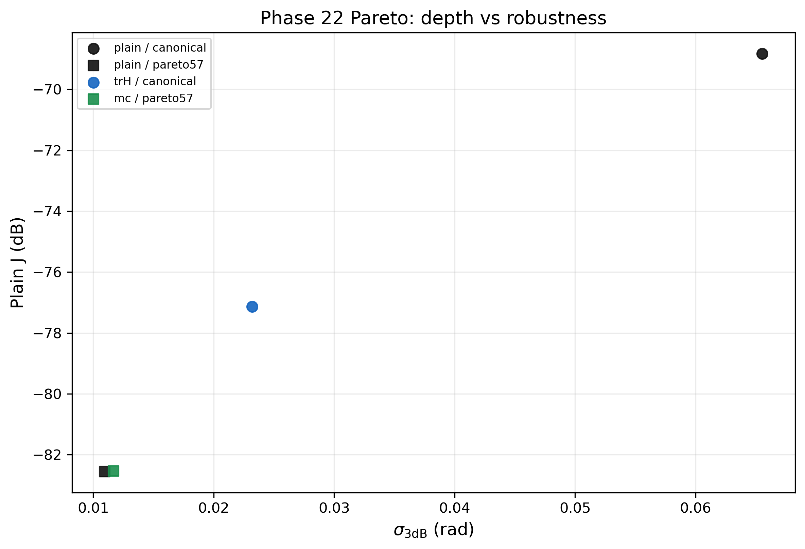

# Phase 22 Summary

**Generated:** 2026-04-20 01:38:57

## Verdict

- Across the completed Phase 22 sweep, every measured optimum remained Hessian-indefinite in the optimized control space. That is the main geometry result: flattening the basin, when it happened at all, did not convert these optima into clean positive-definite minima.
- On the canonical point, the best robustness gain was 0.000 rad at a depth cost of 0.00 dB; on the Pareto-57 point, the best gain was 0.001 rad at a depth cost of 0.03 dB.
- The current evidence does not justify replacing the default log-dB optimizer. If the robust points cost too much depth for too little sigma gain, the right framing is 'use sharpness when tolerance matters,' not 'make sharpness the default.'
- Within this sweep, the best robustness-depth tradeoff was delivered most consistently by `plain`.

## Artifacts

- Result bundle: `/Users/ignaciojlizama/RiveraLab/raman-wt-sharpness/scripts/../results/raman/phase22/phase22_results_smoke.jld2`
- Pareto plot: `/Users/ignaciojlizama/RiveraLab/raman-wt-sharpness/scripts/../results/raman/phase22/phase22_pareto.png`
- Standard images: `/Users/ignaciojlizama/RiveraLab/raman-wt-sharpness/scripts/../.planning/phases/22-sharpness-research/images`
- Completed records: `4` successful / `0` failed

## Pareto Plot

## Hessian Indefiniteness Table

| Operating Point | Flavor | Strength | J_dB | sigma_3dB | Indefinite? | |lambda_min|/lambda_max |
|---|---|---:|---:|---:|:---:|---:|
| canonical | plain | 0 | -68.82 | 0.066 | YES | 2.174e-02 |
| canonical | trH | 1.000e-04 | -77.13 | 0.023 | YES | 1.092e-02 |
| pareto57 | mc | 1.000e-02 | -82.53 | 0.012 | YES | 2.418e-01 |
| pareto57 | plain | 0 | -82.56 | 0.011 | YES | 2.382e-01 |
